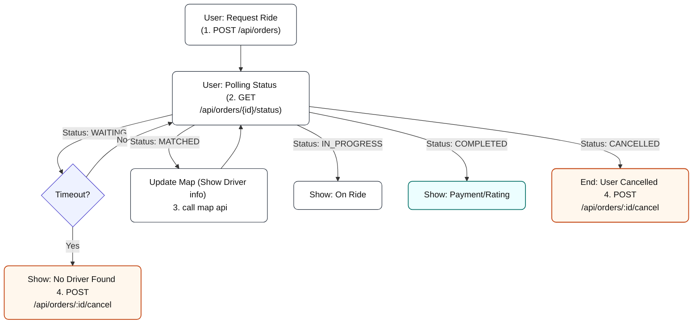

# Order flow 流程與測試

## Struct Order

```go
type Order struct {
    ID            types.ID
    PassengerID   types.ID
    DriverID      *types.ID
    Status        Status
    StatusVersion int
    Pickup        types.Point
    Dropoff       types.Point
    RideType      string
    EstimatedFee  types.Money
    ActualFee     *types.Money
    CreatedAt     time.Time
    MatchedAt     *time.Time
    AcceptedAt    *time.Time
    StartedAt     *time.Time
    CompletedAt   *time.Time
    CancelledAt   *time.Time
    CancelReason  *string
}
```

Order設計依照以下workflow，一個訂單會由Request Ride開始。
若 user cancelled 或司機拒絕/取消，狀態會移動到 Ride Denied/Cancelled；司機取消時，App 端會再觸發一次 Request Ride 重新媒合。Ride Denied 與取消都會記錄到 db。

目前的


## Cases:

App User flow:

* Request Ride
```http
POST {{baseUrl}}/api/orders
Content-Type: application/json

{
    "passenger_id": "1aa2vvdd3",
    "pickup_lat": 25.033,
    "pickup_lng": 121.565,
    "dropoff_lat": 25.0478,
    "dropoff_lng": 121.5318,
    "ride_type": "economy"
}
Expected: Success, Fail
```
* Check status
```http
POST {{baseUrl}}/api/orders/{{order_id}}/status
Expected: WAITING | MATCHED | IN_PROGRESS | COMPLETED | CANCELLED
```

* User cancel order
```http
POST {{baseUrl}}/api/orders/{{order_id}}/cancelled
```


* Case 1

```txt
User request ride:
User cancelled:
```
* Case 2

```txt
User request ride:
Driver Found:
Driver Accept/ Denied:
User cancelled:
```

* Case 3

```txt
User request ride:
Driver Found:
Driver Accept:
Driver Denied:
```
